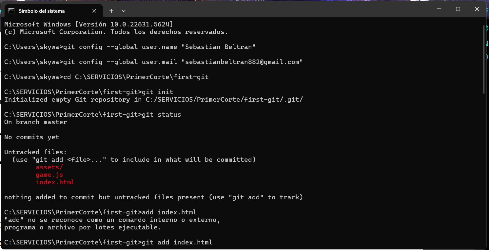
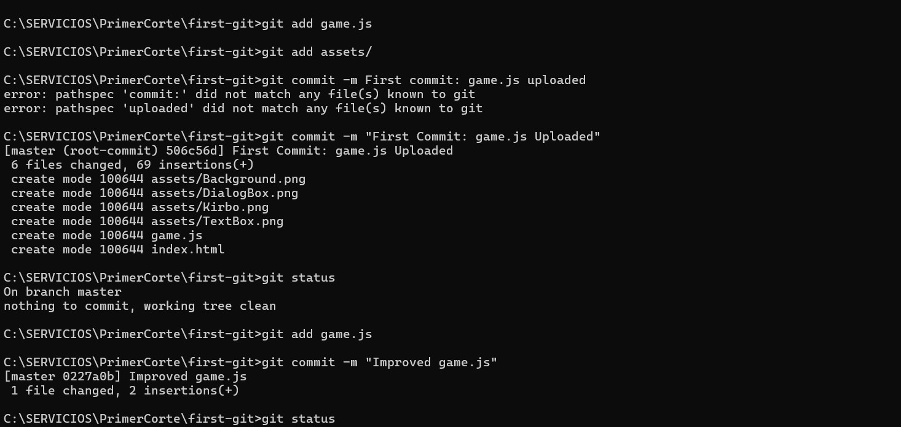
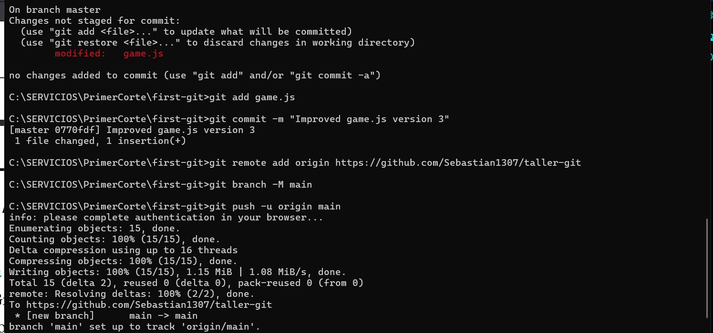

# Kirbo paisa Adivina 

## Este taller fue realizado por SEBASTIAN BELTRAN

Este taller se hizo como un juego para adivinar un número, con una interfaz estilizada basada en juegos de **Kirby**.  
A continuación, imágenes del proceso del `git log`:

## Para probar el juego haz click a este boton

---

###  Creacion repositorio

- 
- 
- 

---

### Clonado y branches

- 

---

---

